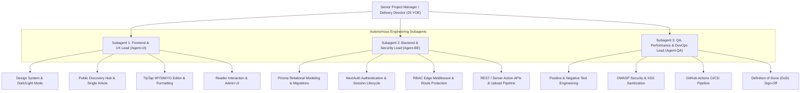
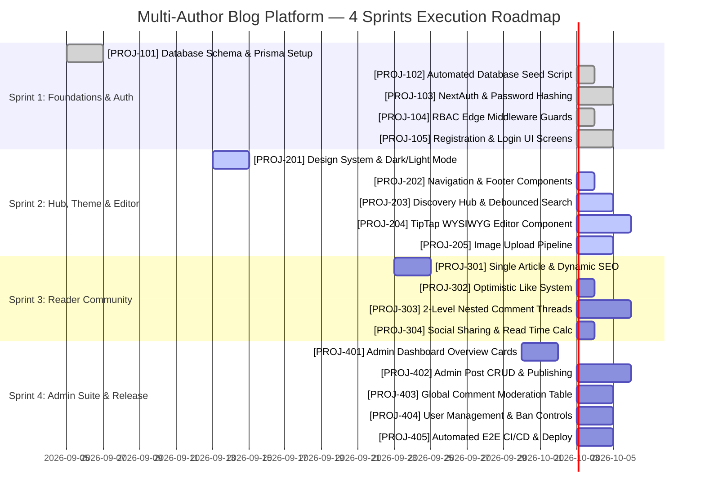

# Full-Stack Multi-Author Blog Platform — Master Development Plan

**Program Management Office (PMO)**  
**Executive Lead**: Senior Project Manager & Technical Delivery Director (25 YOE)  
**Project**: Enterprise Multi-Author Blog Platform  
**Tech Stack**: Next.js App Router, React, Tailwind CSS v3.4, Prisma ORM, PostgreSQL, NextAuth.js, TipTap WYSIWYG  
**Methodology**: Agile Scrum with Autonomous Engineering Subagent Squads  
**Delivery Cycles**: 4 Milestones / Sprints (Total Velocity: 74 Story Points across 19 Issues)

---

## 1. Executive Program Governance & Autonomous Subagent Squads

With 25 years of enterprise delivery experience across mission-critical systems, this development plan operates under an **Autonomous Agent Squad Model**. Three specialized virtual subagents have been spawned to lead their respective functional disciplines:



### 1.1 Subagent Roles & Mandates
1. **Subagent 1: Frontend & UX Engineering Lead (`Agent-UI`)**:
   - **Primary Objective**: Deliver a visually captivating, ultra-responsive, accessible user interface.
   - **Core Domains**: Client components, Tailwind CSS v3.4 design system, dark/light theme switching, glassmorphic headers, TipTap WYSIWYG integrations, reader interactions (optimistic likes, 2-level comment threads), and responsive layouts (mobile, tablet, desktop).
2. **Subagent 2: Backend, Database & Security Engineering Lead (`Agent-BE`)**:
   - **Primary Objective**: Architect a scalable, type-safe data and authentication infrastructure.
   - **Core Domains**: Prisma schema design, relational cascades, database migrations, automated seeding, NextAuth.js session callbacks, bcrypt hashing, Next.js Edge Middleware route guards, and multipart file upload pipelines.
3. **Subagent 3: QA, Performance & DevOps Engineering Lead (`Agent-QA`)**:
   - **Primary Objective**: Guarantee zero-defect quality, high performance (90+ CWV), and automated CI/CD releases.
   - **Core Domains**: Positive/negative test execution, XSS defense, edge-case vulnerability testing, GitHub Actions CI workflows, and Vercel production deployment orchestration.

---

## 2. Global Definition of Done (DoD)

No issue or sprint ticket can be marked **`DONE / CLOSED`** without meeting all of the following non-negotiable criteria:
1. **Type Safety & Linting**: `npx tsc --noEmit` returns 0 errors in TypeScript strict mode; ESLint passes with 0 warnings.
2. **Cross-Platform Responsiveness**: Pixel-perfect rendering across mobile (360px), tablet (768px), and desktop (1280px+) with no layout overflow.
3. **Theme Integrity**: Seamless transition between dark and light themes with zero FOUC (flash of unstyled content).
4. **Security & Validation**: Every API payload is validated with strict type schemas; inputs sanitized to prevent XSS/injection; RBAC routes guarded.
5. **Test Verification**: All specified Positive and Negative test cases executed and passed.
6. **Peer Review**: Signed off by both the assigned Squad Lead and the QA/DevOps Lead.

---

## 3. GitHub Ticket Taxonomy & Labeling System

All issues created in GitHub will strictly use the standardized label taxonomy:

| Label | Color | Description |
| :--- | :--- | :--- |
| `user story` | `#0E8A16` | End-user functional capability |
| `frontend` | `#1D76DB` | UI, layout, styling, and client components |
| `backend` | `#5319E7` | Database, APIs, auth, and server logic |
| `enhancement` | `#A2EEEF` | New feature or architectural enhancement |
| `bug` | `#D93F0B` | Defect, unexpected failure, or regression |
| `security` | `#B60205` | RBAC authorization, password security, XSS defense |
| `qa` | `#FBCA04` | Testing matrices, validations, and quality checks |
| `devops` | `#0052CC` | CI/CD, build verification, and deployment |
| `p0` | `#B60205` | Blocker / Critical priority |
| `p1` | `#D93F0B` | High priority |
| `p2` | `#FBCA04` | Medium priority |

---

## 4. Sprint Breakdown & Complete Issue Specifications



---

### Sprint 1: Architecture, Core Backend, DB Foundations & RBAC Auth

#### Ticket `[PROJ-101]`: Database Schema Design & Prisma Setup
- **Assigned Subagent**: `Agent-BE` (Backend & Security Lead)
- **Labels**: `backend`, `user story`, `p0`
- **Story Points**: 5
- **User Story**:
  > *As a System Architect, I want a complete relational schema for Users, Posts, Categories, Tags, Comments, and Likes, so that all core entities and relationships are modeled with type safety and referential integrity.*
- **Issue Summary**:
  - Configure `prisma/schema.prisma` with models:
    - `User`: `id`, `name`, `email`, `passwordHash`, `role` (`ADMIN` | `READER`), `bio`, `image`, `isBanned`.
    - `Post`: `id`, `title`, `slug`, `excerpt`, `content`, `coverImage`, `published`, `isFeatured`, `views`, `readingTime`, `authorId`, `categoryId`.
    - `Category` & `Tag`: categorization taxonomy.
    - `Comment`: self-referencing hierarchy (`parentId`) for 2-level threaded replies.
    - `Like`: compound unique index `[postId, userId]`.
  - Establish Prisma client singleton at `src/lib/prisma.ts`.
- **Positive Test Cases**:
  - `TC-101.1`: Running `npx prisma validate` returns 0 validation errors.
  - `TC-101.2`: `npx prisma generate` outputs strongly-typed models accessible across the application.
  - `TC-101.3`: Deleting a `Post` record cascades and cleanly removes associated `Comment`, `PostTag`, and `Like` records.
- **Negative Test Cases**:
  - `TC-101.4`: Attempting to insert a duplicate email into `User` throws a unique constraint violation (`P2002`).
  - `TC-101.5`: Attempting to insert a second `Like` record with the same `[postId, userId]` throws a unique constraint error.
- **Definition of Done**:
  - Validated schema, migrations created, Prisma client compiled, foreign key relationships verified.

---

#### Ticket `[PROJ-102]`: Automated Database Seed Script
- **Assigned Subagent**: `Agent-BE` (Backend & Security Lead)
- **Labels**: `backend`, `enhancement`, `p1`
- **Story Points**: 3
- **User Story**:
  > *As a Developer or QA Engineer, I want an automated seed script that provisions an initial Admin, sample readers, categories, and populated blog posts, so that the platform can be instantly tested and demonstrated.*
- **Issue Summary**:
  - Implement `prisma/seed.ts`.
  - Admin credentials: `admin@example.com` / `Admin123!` (role: `ADMIN`).
  - Sample Readers: `jane@example.com` / `Reader123!`, `alex@example.com` / `Reader123!`.
  - 5 Standard Categories: Web Development, AI & Machine Learning, UI/UX Design, Cloud Architecture, Career Advice.
  - 4 Rich Articles with cover images, formatted HTML, tags, comments, replies, and like records.
- **Positive Test Cases**:
  - `TC-102.1`: Command `npx prisma db seed` executes and exits with return code 0.
  - `TC-102.2`: Querying database returns Admin with bcrypt-hashed password and correct role.
  - `TC-102.3`: Querying `Post` table returns 4 published posts with tags and categories attached.
- **Negative Test Cases**:
  - `TC-102.4`: Running `seed.ts` multiple times (idempotency check) upserts existing records without crashing or duplicating unique keys.
- **Definition of Done**:
  - Script successfully seeds the database; verified via Prisma Studio or direct query.

---

#### Ticket `[PROJ-103]`: NextAuth & Password Hashing with Bcrypt
- **Assigned Subagent**: `Agent-BE` (Backend & Security Lead)
- **Labels**: `backend`, `security`, `user story`, `p0`
- **Story Points**: 5
- **User Story**:
  > *As a Registered User or Admin, I want to securely log in with my email and password, so that I receive an authenticated session with my role and user ID.*
- **Issue Summary**:
  - Configure NextAuth in `src/lib/auth.ts` using `CredentialsProvider`.
  - Use `bcryptjs.compare` for secure password matching.
  - Configure `jwt` and `session` callbacks to inject `user.role`, `user.id`, and `user.isBanned` into the client session.
  - Mount handlers in `src/app/api/auth/[...nextauth]/route.ts`.
- **Positive Test Cases**:
  - `TC-103.1`: Valid Admin credentials (`admin@example.com` / `Admin123!`) return an authenticated session with `role: 'ADMIN'`.
  - `TC-103.2`: Valid Reader credentials return an authenticated session with `role: 'READER'`.
  - `TC-103.3`: Calling `useSession()` on the client returns the user object with `id`, `name`, `email`, and `role`.
- **Negative Test Cases**:
  - `TC-103.4`: Providing an unregistered email returns an authorization failure.
  - `TC-103.5`: Providing an invalid password returns `CredentialsSignin` error.
  - `TC-103.6`: Attempting login when `isBanned === true` rejects session creation with "Account suspended".
- **Definition of Done**:
  - Password hashing verified with bcrypt salt rounds >= 10; session cookies secured (`HttpOnly`, `SameSite=Lax`).

---

#### Ticket `[PROJ-104]`: RBAC Edge Middleware & Route Guards
- **Assigned Subagent**: `Agent-BE` (Backend & Security Lead)
- **Labels**: `backend`, `security`, `p0`
- **Story Points**: 5
- **User Story**:
  > *As a System Administrator, I want non-admin users and anonymous visitors blocked from accessing `/admin` pages and admin APIs, so that administrative control is completely secure.*
- **Issue Summary**:
  - Create `src/middleware.ts` using NextAuth token inspection.
  - Intercept `/admin/:path*` and `/api/admin/:path*`.
  - Unauthenticated requests redirect to `/login?callbackUrl=/admin`.
  - Authenticated non-admin requests redirect to `/` with an unauthorized alert.
- **Positive Test Cases**:
  - `TC-104.1`: Authenticated Admin accesses `/admin` and receives HTTP 200.
  - `TC-104.2`: Anonymous visitor navigates to public pages (`/`, `/blog/[slug]`) with HTTP 200 without obstruction.
- **Negative Test Cases**:
  - `TC-104.3`: Anonymous visitor attempts to visit `/admin` -> redirected immediately to `/login`.
  - `TC-104.4`: Reader attempts to visit `/admin` -> redirected to `/` with error status.
  - `TC-104.5`: Direct HTTP POST/PATCH to `/api/admin/*` by non-admin returns HTTP 403 Forbidden.
- **Definition of Done**:
  - All admin routes protected at the Edge; unit tests confirm redirects and 403 responses.

---

#### Ticket `[PROJ-105]`: User Registration & Login UI Screens
- **Assigned Subagent**: `Agent-UI` (Frontend & UX Lead)
- **Labels**: `frontend`, `user story`, `p1`
- **Story Points**: 3
- **User Story**:
  > *As a Visitor, I want a clean, modern registration and login screen, so that I can create an account and sign into the platform effortlessly.*
- **Issue Summary**:
  - Build `src/app/login/page.tsx` and `src/app/register/page.tsx`.
  - Create registration API `src/app/api/auth/register/route.ts` validating name, email, and password.
  - Include form validation, loading states, error banners, and "Show/Hide Password" toggle.
- **Positive Test Cases**:
  - `TC-105.1`: Registering a new account creates a user with `role: 'READER'` and redirects to login.
  - `TC-105.2`: Logging in with newly created credentials updates session and redirects to original destination.
- **Negative Test Cases**:
  - `TC-105.3`: Submitting invalid email displays inline validation error ("Please enter a valid email address").
  - `TC-105.4`: Submitting password shorter than 6 characters blocks submission with warning.
  - `TC-105.5`: Submitting an already-registered email displays "Email already registered".
- **Definition of Done**:
  - Pages are responsive, accessible (aria labels, keyboard navigation), and styled for dark/light modes.

---

### Sprint 2: Public Discovery Hub, Theming & TipTap WYSIWYG Editor

#### Ticket `[PROJ-201]`: Design System, CSS Tokens & Dark/Light Mode Switcher
- **Assigned Subagent**: `Agent-UI` (Frontend & UX Lead)
- **Labels**: `frontend`, `enhancement`, `p1`
- **Story Points**: 3
- **User Story**:
  > *As a Reader or Admin, I want a modern dark and light mode toggle that remembers my preference, so that I have a comfortable reading experience in any lighting condition.*
- **Issue Summary**:
  - Configure `tailwind.config.js` with `darkMode: 'class'`, `@tailwindcss/typography`, and modern indigo/violet accents.
  - Add theme CSS variables in `src/app/globals.css`.
  - Build `ThemeToggle.tsx` persisting state in `localStorage` and toggling `dark` on `<html>`.
- **Positive Test Cases**:
  - `TC-201.1`: Clicking ThemeToggle switches smoothly between dark and light themes.
  - `TC-201.2`: Reloading the page maintains the user's previously chosen theme.
  - `TC-201.3`: `prefers-color-scheme` media query sets initial theme if no local preference is stored.
- **Negative Test Cases**:
  - `TC-201.4`: Disabling JavaScript defaults to clean light theme without layout breaking.
- **Definition of Done**:
  - Zero FOUC; contrast ratios meet WCAG AA standards in both themes.

---

#### Ticket `[PROJ-202]`: Public Navigation & Footer Components
- **Assigned Subagent**: `Agent-UI` (Frontend & UX Lead)
- **Labels**: `frontend`, `enhancement`, `p2`
- **Story Points**: 3
- **User Story**:
  > *As a Visitor, I want a glassmorphic top navigation bar and informative footer, so that I can easily browse categories, search, log in, or access my account.*
- **Issue Summary**:
  - Build `Navbar.tsx` with logo, category navigation, search trigger, ThemeToggle, and user profile dropdown.
  - Display "Admin Dashboard" badge if user has `ADMIN` role.
  - Build `Footer.tsx` with newsletter input, category links, social links, and copyright.
- **Positive Test Cases**:
  - `TC-202.1`: Anonymous visitor sees "Sign In" and "Get Started" buttons.
  - `TC-202.2`: Registered reader sees avatar dropdown with "My Profile" and "Sign Out".
  - `TC-202.3`: Admin sees prominent "Admin Dashboard" link.
  - `TC-202.4`: Mobile view collapses into responsive hamburger slide-out drawer.
- **Negative Test Cases**:
  - `TC-202.5`: Rapid clicking on mobile drawer toggle does not create frozen animation states.
- **Definition of Done**:
  - Responsive across all viewports; glassmorphism backdrop-blur verified; accessible drawer.

---

#### Ticket `[PROJ-203]`: Public Discovery Hub (Featured Hero, Debounced Search, Category Filter)
- **Assigned Subagent**: `Agent-UI` (Frontend & UX Lead)
- **Labels**: `frontend`, `user story`, `p0`
- **Story Points**: 5
- **User Story**:
  > *As a Reader, I want to view a featured hero article, search posts in real time, and filter by categories and sort criteria, so that I can discover content quickly.*
- **Issue Summary**:
  - Build `FeaturedHero.tsx` for spotlighting the latest featured article with gradient accents.
  - Build `SearchBar.tsx` with 300ms debounced live search querying title and excerpt.
  - Category pill carousel (All, Web Dev, AI, Design, Cloud, Career).
  - Sort dropdown: Latest, Most Liked, Most Viewed.
  - Responsive grid using `BlogCard.tsx`.
- **Positive Test Cases**:
  - `TC-203.1`: Typing a search keyword filters matching cards in real time without page reload.
  - `TC-203.2`: Clicking a category pill filters the list to articles belonging to that category.
  - `TC-203.3`: Changing sort option to "Most Liked" reorders articles by like count descending.
- **Negative Test Cases**:
  - `TC-203.4`: Search queries returning no results render a clean empty state ("No articles found").
  - `TC-203.5`: Special characters (`<`, `>`, `&`, `"`) in the search input are sanitized without error.
- **Definition of Done**:
  - Debounced search verified with 0 UI stutter; pagination/load more functional.

---

#### Ticket `[PROJ-204]`: TipTap WYSIWYG Editor Component with Formatting Toolbar
- **Assigned Subagent**: `Agent-UI` (Frontend & UX Lead)
- **Labels**: `frontend`, `enhancement`, `user story`, `p0`
- **Story Points**: 5
- **User Story**:
  > *As an Author / Admin, I want a rich WYSIWYG editor with headings, lists, code blocks, blockquotes, and image embedding, so that I can create visually captivating blog posts.*
- **Issue Summary**:
  - Implement `RichTextEditor.tsx` using `@tiptap/react`, `@tiptap/starter-kit`.
  - Extensions: `@tiptap/extension-image`, `@tiptap/extension-link`, `@tiptap/extension-placeholder`.
  - Toolbar buttons: Bold, Italic, Strikethrough, Code, H1, H2, H3, Bullet List, Numbered List, Blockquote, Code Block, Link modal, Image insert modal.
  - Live word count and dynamic reading time calculation.
- **Positive Test Cases**:
  - `TC-204.1`: Typing and formatting text with H1, bold, and bullet list produces valid semantic HTML.
  - `TC-204.2`: Adding a hyperlink wraps selected text in an `<a>` tag with `rel="noopener noreferrer"`.
  - `TC-204.3`: Inserting an image URL or uploaded file embeds the image inline inside the editor.
- **Negative Test Cases**:
  - `TC-204.4`: Pasting raw HTML containing `<script>` or `<onerror>` tags strips dangerous code cleanly.
  - `TC-204.5`: Submitting an empty editor triggers a "Content cannot be empty" validation prompt.
- **Definition of Done**:
  - Editor produces valid sanitized HTML; output styling matches the public article view.

---

#### Ticket `[PROJ-205]`: Multipart File & Cover Image Upload API Pipeline
- **Assigned Subagent**: `Agent-BE` (Backend & Security Lead)
- **Labels**: `backend`, `enhancement`, `p1`
- **Story Points**: 3
- **User Story**:
  > *As an Author / Admin, I want to upload image files for blog covers and article content, so that they are saved and accessible via high-speed public URLs.*
- **Issue Summary**:
  - Build `src/app/api/upload/route.ts`.
  - Accept `multipart/form-data`.
  - Validate mime types (`image/jpeg`, `image/png`, `image/webp`, `image/gif`).
  - Validate file size (<= 5MB).
  - Save file to `/public/uploads/` with generated UUID filename.
  - Return JSON `{ url: "/uploads/<uuid>.<ext>" }`.
- **Positive Test Cases**:
  - `TC-205.1`: Uploading a valid 2MB PNG returns HTTP 200 with the public image URL.
  - `TC-205.2`: Requesting the returned image URL in a browser serves the image correctly.
- **Negative Test Cases**:
  - `TC-205.3`: Uploading a file larger than 5MB returns HTTP 400 with "File size exceeds 5MB limit".
  - `TC-205.4`: Uploading an executable file (.exe) disguised as image returns HTTP 400 "Invalid file type".
  - `TC-205.5`: Non-admin or unauthenticated upload request returns HTTP 401/403.
- **Definition of Done**:
  - Storage directory auto-created if missing; mime validation and size limit verified.

---

### Sprint 3: Reader Engagement, Threaded Comments & Like System

#### Ticket `[PROJ-301]`: Single Blog Article Page with Dynamic Typography & SEO Metadata
- **Assigned Subagent**: `Agent-UI` (Frontend & UX Lead)
- **Labels**: `frontend`, `user story`, `p0`
- **Story Points**: 5
- **User Story**:
  > *As a Reader or Visitor, I want to read a full article with beautiful typography, author details, reading time, and social share buttons, so that I enjoy an immersive reading experience.*
- **Issue Summary**:
  - Build `src/app/blog/[slug]/page.tsx`.
  - Dynamic Next.js metadata generation (`title`, `description`, `openGraph`).
  - Increment post `views` count on page load.
  - Render content using `@tailwindcss/typography` (`prose prose-indigo dark:prose-invert lg:prose-lg max-w-none`).
  - Author bio section with avatar and publication date.
- **Positive Test Cases**:
  - `TC-301.1`: Navigating to `/blog/valid-slug` displays title, cover image, styled typography, and author bio.
  - `TC-301.2`: Database `views` counter increments by 1 on each visit.
  - `TC-301.3`: HTML head contains valid OpenGraph and Twitter card meta tags.
- **Negative Test Cases**:
  - `TC-301.4`: Navigating to an invalid slug returns Next.js `notFound()` (HTTP 404).
  - `TC-301.5`: Unpublished draft posts return 404 for regular readers, but remain previewable by Admins.
- **Definition of Done**:
  - Typography renders cleanly in dark/light mode; SEO tags verified via social preview checkers.

---

#### Ticket `[PROJ-302]`: Interactive Like/Heart System with Optimistic UI
- **Assigned Subagent**: `Agent-BE` & `Agent-UI`
- **Labels**: `frontend`, `backend`, `user story`, `p1`
- **Story Points**: 3
- **User Story**:
  > *As a Registered Reader, I want to like or unlike an article with a single click, so that I can express my appreciation and see the count update instantly.*
- **Issue Summary**:
  - API endpoint `POST /api/posts/[id]/like` (toggles `Like` record).
  - Client component `LikeButton.tsx` with animated heart icon.
  - Optimistic UI updates count immediately on click.
  - If unauthenticated, displays toast notification prompting visitor to sign in.
- **Positive Test Cases**:
  - `TC-302.1`: Logged-in reader clicks like: heart fills red, counter increments by 1.
  - `TC-302.2`: Clicking like again unlikes post: heart returns to outline, counter decrements by 1.
  - `TC-302.3`: Page refresh preserves user's liked status and accurate total count.
- **Negative Test Cases**:
  - `TC-302.4`: Anonymous visitor clicks like: count does NOT increment; toast prompt appears: "Please log in to like this post".
  - `TC-302.5`: Network failure reverts optimistic UI update and displays an error alert.
- **Definition of Done**:
  - Compound unique key `[postId, userId]` enforced; smooth heart micro-animation.

---

#### Ticket `[PROJ-303]`: 2-Level Nested Comment & Reply Thread Engine
- **Assigned Subagent**: `Agent-BE` & `Agent-UI`
- **Labels**: `frontend`, `backend`, `user story`, `p0`
- **Story Points**: 5
- **User Story**:
  > *As a Reader, I want to post comments and reply directly to other readers' comments, and edit or delete my own remarks, so that I can participate in community discussions.*
- **Issue Summary**:
  - Build `CommentSection.tsx` and `CommentItem.tsx`.
  - API endpoints:
    - `GET /api/posts/[id]/comments`: returns parent comments with nested replies.
    - `POST /api/posts/[id]/comments`: creates root comment or reply if `parentId` provided.
    - `PATCH /api/comments/[id]`: edits comment content (enforcing author ownership).
    - `DELETE /api/comments/[id]`: deletes comment (enforcing author ownership or `ADMIN` role).
  - Visual hierarchy: Parent comment with subtle border; nested reply indented with left line.
- **Positive Test Cases**:
  - `TC-303.1`: Registered reader submits a root comment: appears instantly in thread.
  - `TC-303.2`: Reader clicks "Reply" on a comment: nested reply appears indented directly under parent.
  - `TC-303.3`: Comment author edits their comment: updates text with "(edited)" timestamp indicator.
  - `TC-303.4`: Comment author deletes their comment: comment disappears from thread.
- **Negative Test Cases**:
  - `TC-303.5`: Anonymous visitor views comments normally, but input displays "Sign in to join the conversation".
  - `TC-303.6`: Reader A attempting to edit or delete Reader B's comment returns HTTP 403.
  - `TC-303.7`: Admin can delete any comment (moderation override).
  - `TC-303.8`: Replying to an existing reply flattens under the parent comment (enforcing 2-level maximum).
- **Definition of Done**:
  - 2-level nesting verified; ownership permissions enforced; XSS sanitized.

---

#### Ticket `[PROJ-304]`: Social Sharing & Dynamic Reading Time Indicator
- **Assigned Subagent**: `Agent-UI` (Frontend & UX Lead)
- **Labels**: `frontend`, `enhancement`, `p2`
- **Story Points**: 2
- **User Story**:
  > *As a Reader, I want quick share buttons (Twitter/X, LinkedIn, Copy Link) and a reading time estimate, so that I know article length and can easily share it.*
- **Issue Summary**:
  - Build `ShareButtons.tsx` (Twitter/X intent URL, LinkedIn share URL, clipboard copy with toast).
  - Calculate reading time dynamically based on 200 words per minute.
- **Positive Test Cases**:
  - `TC-304.1`: Clicking "Copy Link" copies URL to clipboard and triggers "Link copied to clipboard!" toast.
  - `TC-304.2`: Clicking "Share on X" opens Twitter intent window with article title and link.
  - `TC-304.3`: Reading time displays accurately (e.g., 600-word post displays "3 min read").
- **Negative Test Cases**:
  - `TC-304.4`: Browsers with disabled clipboard API gracefully fallback to selecting URL text.
- **Definition of Done**:
  - Share URLs tested; copy toast dismisses after 2.5 seconds; responsive across viewports.

---

### Sprint 4: Admin Management Suite, Analytics, QA & Deployment

#### Ticket `[PROJ-401]`: Admin Dashboard Layout & Metric Overview Cards
- **Assigned Subagent**: `Agent-UI` & `Agent-BE`
- **Labels**: `frontend`, `backend`, `user story`, `p1`
- **Story Points**: 3
- **User Story**:
  > *As an Administrator, I want an overview dashboard displaying high-level platform metrics, so that I can monitor health and engagement.*
- **Issue Summary**:
  - Build `src/app/admin/layout.tsx` with collapsible sidebar navigation.
  - Build `src/app/admin/page.tsx`.
  - Metric cards: Total Articles, Published Posts, Drafts, Total Views, Total Likes, Total Comments, Total Users.
  - Recent activity feed (latest published posts and newest comments).
  - Quick action shortcuts ("Create New Post", "Moderate Comments").
- **Positive Test Cases**:
  - `TC-401.1`: Admin logs in and opens `/admin`: all 6 KPI cards display accurate counts queried from DB.
  - `TC-401.2`: Sidebar navigation links highlight active route (`Dashboard`, `Posts`, `Comments`, `Users`).
  - `TC-401.3`: "Back to Website" link seamlessly returns to public homepage.
- **Negative Test Cases**:
  - `TC-401.4`: Non-admin user opening `/admin` is intercepted and blocked by middleware.
- **Definition of Done**:
  - Metric counts calculated via efficient SQL aggregations (`prisma.post.count()`, `prisma.post.aggregate()`).

---

#### Ticket `[PROJ-402]`: Admin Post Management, Publishing & Feature Controls
- **Assigned Subagent**: `Agent-BE` & `Agent-UI`
- **Labels**: `frontend`, `backend`, `user story`, `p0`
- **Story Points**: 5
- **User Story**:
  > *As an Administrator, I want to manage all articles (create, edit, delete, publish/draft toggle, feature toggle), so that I have full content governance.*
- **Issue Summary**:
  - Data table at `src/app/admin/posts/page.tsx`:
    - Columns: Title, Author, Category, Status (Published/Draft), Featured, Views, Date, Actions.
    - Status filter (All, Published, Draft).
    - In-table toggle for `published` and `isFeatured`.
    - Delete post with confirmation modal.
  - Post creation page `src/app/admin/posts/new/page.tsx`.
  - Post edit page `src/app/admin/posts/[id]/edit/page.tsx`.
- **Positive Test Cases**:
  - `TC-402.1`: Admin creates a post with cover image, category, and TipTap content: post saves and redirects to posts list.
  - `TC-402.2`: Toggling "Published" switch instantly changes status and reflects on public homepage.
  - `TC-402.3`: Toggling "Featured" switch highlights the post in the Homepage Hero banner.
  - `TC-402.4`: Deleting a post removes it from database and public views.
- **Negative Test Cases**:
  - `TC-402.5`: Submitting a post without a title displays "Title is required" error.
  - `TC-402.6`: Duplicate slug automatically appends unique timestamp/hash suffix to avoid collision.
- **Definition of Done**:
  - Full CRUD operations functional; optimistic UI updates for toggles; delete confirmation modal safe.

---

#### Ticket `[PROJ-403]`: Global Comment Moderation Suite
- **Assigned Subagent**: `Agent-BE` & `Agent-UI`
- **Labels**: `frontend`, `backend`, `user story`, `p1`
- **Story Points**: 3
- **User Story**:
  > *As an Administrator, I want a central table of all comments across all blog posts with one-click deletion, so that I can moderate toxicity and spam.*
- **Issue Summary**:
  - Build `src/app/admin/comments/page.tsx`.
  - Table columns: Author Name/Email, Comment Text Snippet, Post Title (linked), Date, Action (Delete).
  - Filter comments by search keyword or author.
  - Single-click delete with confirmation prompt.
- **Positive Test Cases**:
  - `TC-403.1`: Navigating to `/admin/comments` lists all parent comments and nested replies chronologically.
  - `TC-403.2`: Clicking the post title link navigates directly to the specific blog article.
  - `TC-403.3`: Admin clicks "Delete": comment is deleted from database and disappears from the post page.
- **Negative Test Cases**:
  - `TC-403.4`: Non-admin attempting to delete comment via API returns HTTP 403.
- **Definition of Done**:
  - Moderation table tested; deletion cascades properly if parent comment has replies.

---

#### Ticket `[PROJ-404]`: User Management, Ban/Unban & Role Control
- **Assigned Subagent**: `Agent-BE` & `Agent-UI`
- **Labels**: `frontend`, `backend`, `security`, `p1`
- **Story Points**: 3
- **User Story**:
  > *As an Administrator, I want to inspect all registered users, toggle their ban status, and promote/demote roles, so that I have full community control.*
- **Issue Summary**:
  - Build `src/app/admin/users/page.tsx`.
  - API endpoint: `PATCH /api/admin/users/[id]` (`isBanned: boolean`, `role: 'ADMIN' | 'READER'`).
  - Display user avatar, name, email, role badge, total comments, join date, status (Active/Banned).
  - Actions: "Ban User" / "Unban User" button, Role select dropdown.
- **Positive Test Cases**:
  - `TC-404.1`: Admin clicks "Ban User": user's status updates to "Banned" in real-time.
  - `TC-404.2`: Admin changes a reader's role to "ADMIN": user gains access to `/admin`.
- **Negative Test Cases**:
  - `TC-404.3`: Banned user attempts to log in: authentication fails with "Account has been suspended".
  - `TC-404.4`: Currently logged-in admin cannot ban their own account (prevents self-lockout).
- **Definition of Done**:
  - Admin cannot accidentally ban self; ban status immediately invalidates session in middleware.

---

#### Ticket `[PROJ-405]`: End-to-End Test Automation, Security Audit & CI/CD Deployment Pipeline
- **Assigned Subagent**: `Agent-QA` (QA, Performance & DevOps Lead)
- **Labels**: `devops`, `qa`, `security`, `p0`
- **Story Points**: 5
- **User Story**:
  > *As a DevOps & Release Lead, I want a complete automated verification suite, GitHub Actions CI workflow, and Vercel production deployment configuration, so that releases are completely robust and reliable.*
- **Issue Summary**:
  - Configure GitHub Actions CI workflow (`.github/workflows/ci.yml`):
    - Lint check (`npm run lint`).
    - Type check (`npx tsc --noEmit`).
    - Build validation (`npm run build`).
  - XSS security audit on TipTap rendered content.
  - Lighthouse performance & accessibility audit (target 90+ across all metrics).
  - Deployment configuration for Vercel with environment variable mapping.
- **Positive Test Cases**:
  - `TC-405.1`: `npm run build` completes successfully with 0 errors and generates static/dynamic routes.
  - `TC-405.2`: GitHub Actions workflow runs on push and pull request with all steps green.
  - `TC-405.3`: Deploying to Vercel with PostgreSQL connection string deploys smoothly.
- **Negative Test Cases**:
  - `TC-405.4`: Introducing a TypeScript error or broken import causes CI to fail and prevents bad deployments.
- **Definition of Done**:
  - Production build green; security audit clean; deployment documentation complete in README.

---

## 5. How to Raise These Tickets on GitHub

We have provided an automated PowerShell script at [scripts/raise_github_tickets.ps1](file:///c:/Users/Acer/OneDrive/Desktop/Blog%20Application/scripts/raise_github_tickets.ps1).

### Execution Steps:
1. **Authenticate GitHub CLI**:
   ```powershell
   gh auth login
   ```
2. **Link or Create your GitHub Repository**:
   ```powershell
   # If creating a new GitHub repo:
   gh repo create blog-application --public --source=. --remote=origin --push

   # Or if linking to an existing GitHub repo:
   git remote add origin https://github.com/YOUR_USERNAME/YOUR_REPO.git
   ```
3. **Execute the Ticket Automation Script**:
   ```powershell
   powershell -ExecutionPolicy Bypass -File .\scripts\raise_github_tickets.ps1
   ```
   *This script automatically creates the 11 color-coded GitHub labels and files all 19 tickets with their full user stories, summaries, positive/negative test cases, and Definition of Done!*
